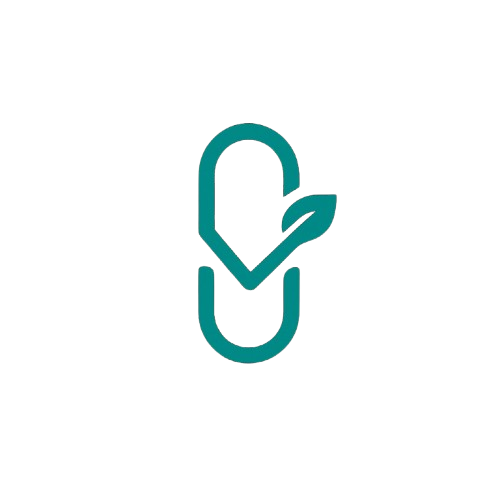
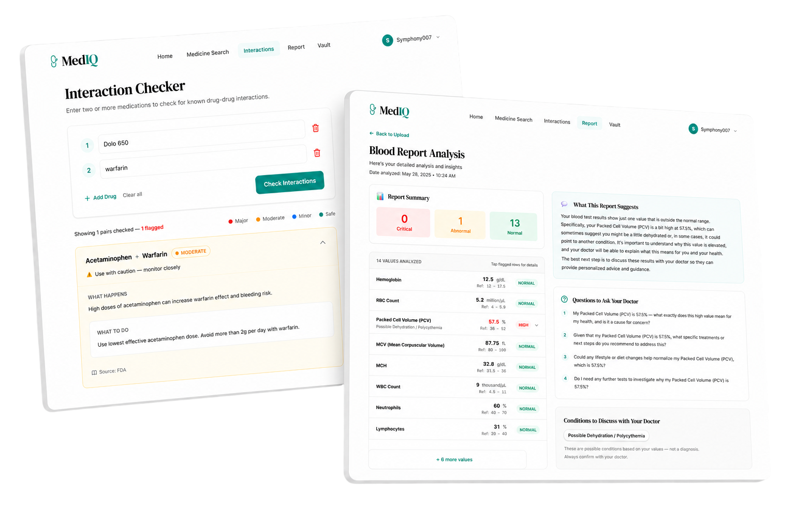

<div align="center">

#  MedIQ — Know Your Medicine Better

**Full-stack medical information platform** — search medicines, check drug interactions, decode blood reports, and manage medications with AI-powered explanations in plain English.

[**Live Demo**](https://mediq-two.vercel.app) &nbsp;|&nbsp; [**Source Code**](https://github.com/diyasha-dev/mediq)

<br />



</div>

<br />

## ⚡ Tech Stack

<table>
<tr>
<td align="center" width="140">
<br /><strong>Next.js 14</strong><br /><sub>App Router, SSR</sub>
</td>
<td align="center" width="140">
<br /><strong>React 18</strong><br /><sub>Client Components</sub>
</td>
<td align="center" width="140">
<br /><strong>Tailwind CSS</strong><br /><sub>v4, Utility-first</sub>
</td>
<td align="center" width="140">
<br /><strong>Supabase</strong><br /><sub>PostgreSQL + Auth</sub>
</td>
<td align="center" width="140">
<br /><strong>Gemini AI</strong><br /><sub>2.5 Flash + Vision</sub>
</td>
<td align="center" width="140">
<br /><strong>Vercel</strong><br /><sub>CI/CD + Hosting</sub>
</td>
</tr>
</table>

**External APIs** &nbsp;→&nbsp; FDA OpenData (drug labels) · RxNorm by NIH (drug standardization) · Gemini Vision (OCR)

---

## ✨ Features

<table>
<tr>
<td width="50%">

### 🔍 Medicine Search
- Search by brand name (Dolo, Combiflam) or generic name
- 60+ Indian brand → generic mappings
- Real FDA data: dosage, side effects, warnings
- AI-powered plain English explanations
- Smart caching — repeat searches are instant

</td>
<td width="50%">

### ⚠️ Drug Interaction Checker
- Check 2–5 medicines for dangerous combinations
- 100+ verified FDA & NHS interaction pairs
- Color-coded severity: `MAJOR` `MODERATE` `MINOR` `SAFE`
- Gemini AI fallback for unknown combinations
- Autocomplete drug name suggestions

</td>
</tr>
<tr>
<td width="50%">

### 🩺 Blood Report Analyzer
- Upload report image or paste text values
- Gemini Vision OCR extracts data from photos
- 50+ parameters with reference ranges
- Severity labels with condition mapping
- Expandable cards: causes, symptoms, diet, doctor type
- AI-generated summary + doctor questions

</td>
<td width="50%">

### 💊 Medication Vault
- Personal medicine list with dosage & frequency
- Push notification reminders (up to 3 per medicine)
- Auto interaction alerts on new additions
- Edit, delete with undo support
- PWA — installable on phone, works offline

</td>
</tr>
</table>

### 🔐 Authentication
Google OAuth + Email/Password signup · Forgot password flow · Protected routes with smart redirects · User avatar dropdown

---

## 🏗️ Architecture

```
┌─────────────────────────────────────────────────────────────┐
│                    CLIENT (Browser / PWA)                    │
│              React Components + Tailwind CSS                │
└──────────────────────────┬──────────────────────────────────┘
                           │
┌──────────────────────────▼──────────────────────────────────┐
│                   NEXT.JS 14 (Vercel)                       │
│                  App Router + API Routes                    │
├─────────────┬─────────────┬──────────────┬──────────────────┤
│ /api/search │ /api/inter  │ /api/report  │ /api/vault       │
│             │   actions   │              │ /api/auth        │
└──────┬──────┴──────┬──────┴───────┬──────┴──────┬───────────┘
       │             │              │             │
┌──────▼──────┐ ┌────▼─────┐ ┌─────▼─────┐ ┌────▼──────────┐
│  FDA + NIH  │ │ Gemini   │ │  Gemini   │ │   Supabase    │
│  RxNorm API │ │ AI 2.5   │ │  Vision   │ │  PostgreSQL   │
│  (drug data)│ │ (explain)│ │  (OCR)    │ │  + Auth + RLS │
└─────────────┘ └──────────┘ └───────────┘ └───────────────┘
```

### Database Schema

| Table | Purpose | Access |
|:------|:--------|:-------|
| `drug_cache` | Cached medicine search results | Public (read) |
| `drug_interactions` | 100+ verified interaction pairs | Public (read) |
| `user_medications` | Personal vault with reminders | RLS — owner only |
| `report_cache` | Blood report analyses | RLS — owner only |
| `search_history` | Per-user search & interaction logs | RLS — owner only |
| `profiles` | User name and avatar | RLS — owner only |

---

## 🔌 API Routes

| Route | Method | Description | Auth |
|:------|:-------|:------------|:----:|
| `/api/search?drug=ibuprofen` | `GET` | Search medicine by name | ✗ |
| `/api/interactions` | `POST` | Check drug interactions | ✗ |
| `/api/report` | `POST` | Analyze blood report (image/text) | ✓ |
| `/api/vault` | `GET` `POST` `PATCH` `DELETE` | Manage medication vault | ✓ |
| `/api/history` | `GET` `POST` `DELETE` | User search history | ✓ |
| `/api/auth/callback` | `GET` | OAuth redirect handler | — |

---

## 🏃 Quick Start

```bash
# Clone & install
git clone https://github.com/diyasha-dev/mediq.git
cd mediq && npm install

# Configure environment
cp .env.example .env.local
```

Add to `.env.local`:

```env
NEXT_PUBLIC_SUPABASE_URL=your_supabase_url
NEXT_PUBLIC_SUPABASE_ANON_KEY=your_anon_key
GEMINI_API_KEY=your_gemini_key
NEXT_PUBLIC_SITE_URL=http://localhost:3000
```

```bash
# Run
npm run dev
```

> **Prerequisites:** Node.js 18+ · Supabase account · [Gemini API key](https://aistudio.google.com) · Google Cloud project (for OAuth)

---

## 📱 PWA Support

MedIQ is a Progressive Web App with Service Worker caching and push notifications:

1. Open [mediq-two.vercel.app](https://mediq-two.vercel.app) on your phone
2. Tap **"Add to Home Screen"** (install prompt auto-appears on Android)
3. Opens fullscreen like a native app with offline support
4. Medication reminders work even when the tab is in background

---

## 🔒 Security

- **Row Level Security** on all user tables — each user sees only their own data
- **Server-side API keys** — Gemini key never exposed to browser
- **Supabase Auth** — passwords are hashed, sessions are secure
- **Vault is opt-in** — no data stored without user action

---

## ⚠️ Disclaimer

MedIQ is for **educational purposes only** and is not a substitute for professional medical advice. Drug interaction data is sourced from FDA and NHS public guidelines. Always consult your doctor or pharmacist.

---

## 👩‍💻 Developer

<table>
<tr>
<td>

**Diyasha Halder**
<br />CS Student · Kolkata, India

[](https://www.linkedin.com/in/diyasha-halder-862760354/)
[](https://github.com/diyasha-dev)
[](mailto:halderdiyasha11@gmail.com)

</td>
</tr>
</table>

---

## 📄 License

MIT — free to use for learning and portfolio reference.

<div align="center">
<br />

**If this project was useful, please ⭐ star the repo!**

Built with Next.js, Supabase & Gemini AI

</div>
